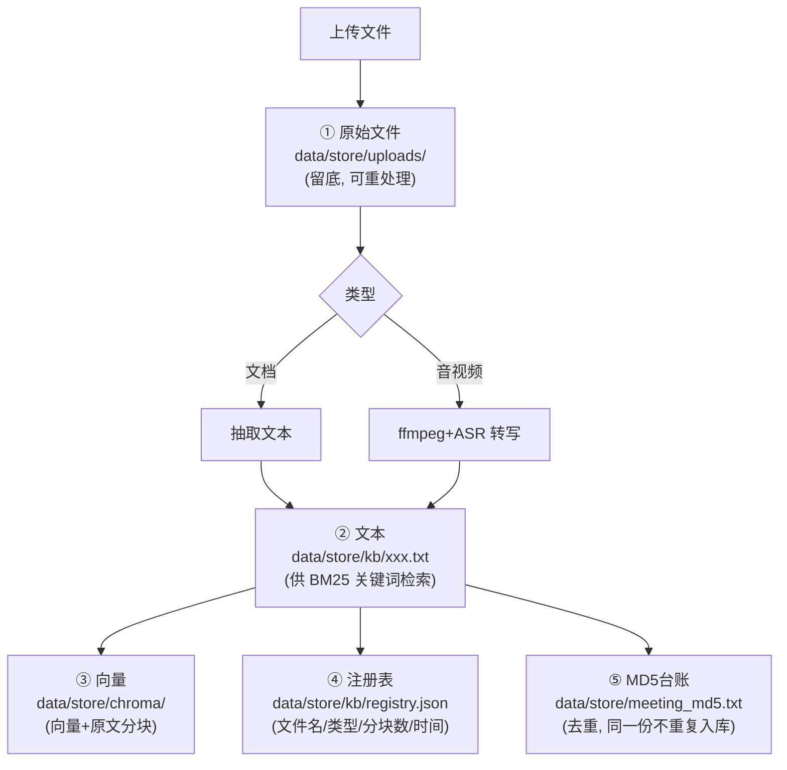
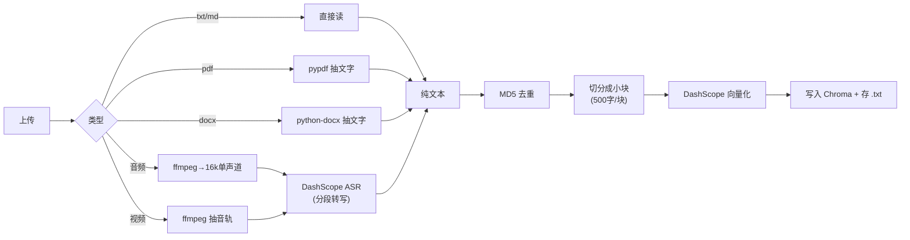
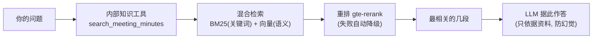
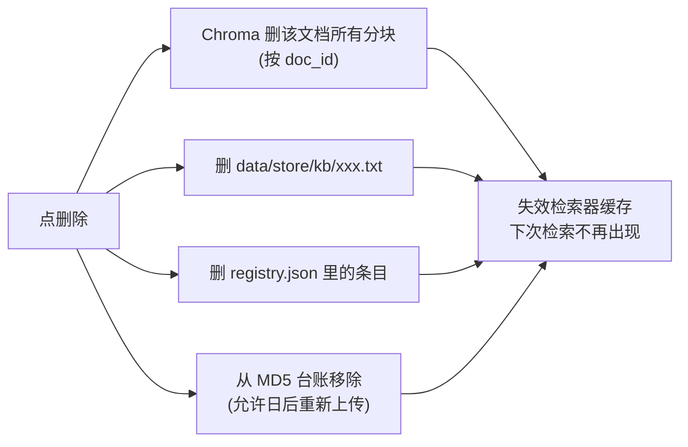

# 知识库上传 —— 文件存哪、AI 怎么消化、怎么删除

> 上传公司内部资料（文档/音视频）→ 自动进 RAG → 「内部知识 Agent」检索回答。
> **所有文件只存本地**，不传第三方。

---

## 一、文件存在哪里（全部本地）

| 编号 | 存什么 | 路径 | 说明 |
|---|---|---|---|
| ① | 上传的**原始文件** | `data/store/uploads/` | 留底，可重新处理 |
| ② | **抽取/转写后的文本** | `data/store/kb/*.txt` | 给 BM25 关键词检索用 |
| ③ | **向量 + 原文分块** | `data/store/chroma/` | 给语义检索用（Chroma 向量库）|
| ④ | **注册表** | `data/store/kb/registry.json` | 列表/删除靠它 |
| ⑤ | **MD5 去重台账** | `data/store/meeting_md5.txt` | 同一份内容不重复入库 |

> `data/store/` 整个被 `.gitignore` 忽略——**永远不会进 GitHub**。

---

## 二、AI 怎么"消化"上传的文件

分两步：**入库（上传时一次性）** 和 **检索（每次提问时）**。

### 入库（上传那一刻）

- **文档**：抽取文字（pdf 用 pypdf、docx 用 python-docx）。几秒完成，同步。
- **音视频**：ffmpeg 转成 16k 单声道 → 按 60 秒分段 → DashScope ASR 逐段转写 → 拼接。慢，走**后台任务**（前端显示"转写入库中…"）。
- 统一收尾：**MD5 去重 → 切分 → 向量化 → 存进 Chroma，同时把文本存成 .txt**。

### 检索（每次提问）

- 通用助手/内部知识 Agent 判断该查内部资料时，调 `search_meeting_minutes`。
- **混合检索**（BM25 关键词 + 向量语义）→ **重排**取最相关几段 → 喂给大模型作答。
- **入库后检索器缓存自动失效**，下次提问会重建、把**新上传的文件也纳入检索**（无需重启）。

---

## 三、删除怎么删（连根拔起）

一次删除会清掉：向量分块 + 文本文件 + 注册条目 + 去重台账 + 检索缓存。**删干净，不残留**。

---

## 四、"AI 好像不懂上传的文件" 怎么自查

按顺序排查：

1. **后端重启了吗？** 上传接口是新加的——**没重启后端，上传根本没接住**（点了等于没传）。
   `Ctrl+C → python server/main.py`
2. **「知识库」面板里，那份文件出现了吗？字数正常吗？**
   - 没出现 → 上传没成功（多半是没重启后端）。
   - 出现了但**"X 字"很小/为 0** → 没抽到文本：可能是**扫描版 PDF（图片无文字）** 或**音视频没识别出语音**。
3. **问法**：内部资料类问题用通用助手最稳（如"公司差旅报销上限是多少"）。投资决策类问题默认只跑行业调研+量化分析，要带"内部/纪要/已有资料"字样才会调内部知识 Agent。
4. **音视频**：中文识别效果不好时，可在 `config/settings.yml` 调 `kb.asr_model` 或分段秒数。

---

## 五、相关代码
- 摄取/转写/删除：[src/rag/kb_service.py](src/rag/kb_service.py)
- 上传/列表/删除/任务 端点：[server/main.py](server/main.py)
- 向量库（含按 doc_id 删除）：[src/rag/vector_store.py](src/rag/vector_store.py)
- 检索（混合+重排+降级）：[src/rag/retriever.py](src/rag/retriever.py)
- 前端面板：[web/components/kb-sheet.tsx](web/components/kb-sheet.tsx)
