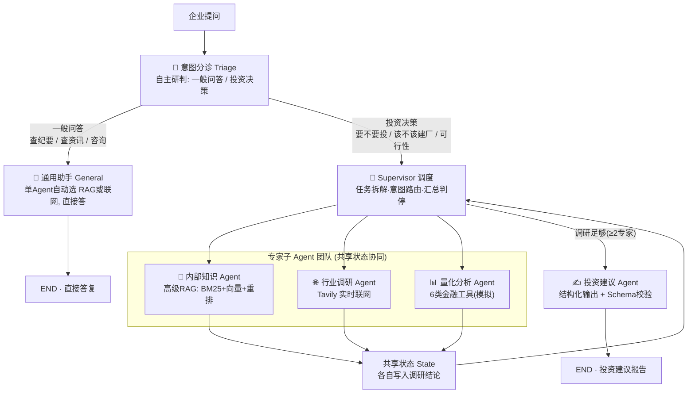
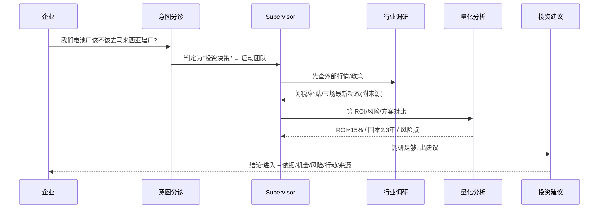
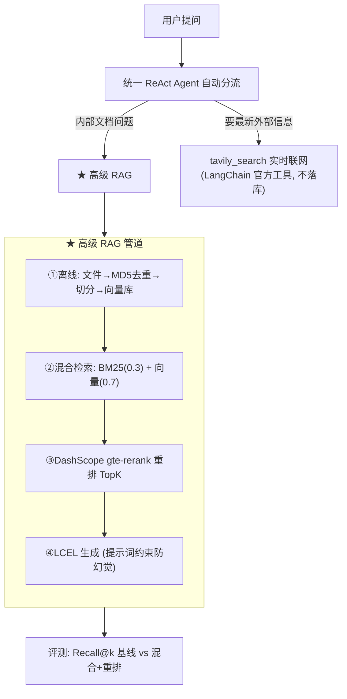

# 商会企业投资顾问（多 Agent · 高级 RAG · 在线检索）

> **企业级智能投资顾问**，面向商会会员企业。一个提问进来，系统**先自主研判意图**，再决定：
> - **一般问答**（查纪要、查资讯、咨询）→ 通用助手直接作答；
> - **投资决策**（要不要投、该不该建厂、可行性）→ **LangGraph Supervisor + 4 专家子Agent** 协作，
>   完成"行业调研 + 内部知识 + 量化分析 → 结构化投资建议"的端到端闭环。
>
> 技术栈：LangChain/LangGraph · Tongyi `qwen-plus` · DashScope `text-embedding-v4` + `gte-rerank` · BM25 · Chroma · Tavily · FastAPI(SSE) · Next.js + shadcn

---

## 0. 多 Agent 企业投资顾问（主功能 · 工作模式）

面向商会会员企业的**企业级智能投资顾问**：一个提问进来，系统**先自主研判意图**，
再决定是"直接答"还是"启动多 Agent 投资决策流程"，最终产出**结构化、可校验、可追溯**的投资建议。

### 0.1 总工作流（系统自主决策）



> **关键：总入口是"意图分诊"**——不是所有问题都出投资报告。
> 简单问题走通用助手直接答；只有"投资决策类"问题才启动多 Agent 团队出报告。

### 0.2 一次投资决策的协作过程（示例）



### 0.3 角色与能力

| 角色 | 职责 | 能力 / 工具 | 实现 |
|---|---|---|---|
| 🧭 意图分诊 | 研判 一般问答 vs 投资决策 | LLM 分类 + 默认兜底 | [supervisor.py](src/graph/supervisor.py) |
| 💬 通用助手 | 直接回答一般问题 | 单 ReAct Agent（内部RAG + 联网，自动选） | [react_agent.py](src/agent/react_agent.py) |
| 🧠 Supervisor | 拆解任务·路由·判停 | LLM 路由 + 规则兜底 + 防死循环（`Command`） | [supervisor.py](src/graph/supervisor.py) |
| 📁 内部知识 | 查商会纪要/区域政策 | 高级RAG：BM25+向量混合 + `gte-rerank` 重排 | [subagents.py](src/agent/subagents.py) |
| 🌐 行业调研 | 查外部行情/政策 | Tavily 实时联网（日期感知） | [subagents.py](src/agent/subagents.py) |
| 📊 量化分析 | 算 ROI/风险/对比 | 6 类金融工具 Function Calling（模拟数据） | [analysis_tools.py](src/agent/analysis_tools.py) |
| ✍️ 投资建议 | 汇总出结构化建议 | LCEL + Pydantic Schema 校验 | [advisor.py](src/agent/advisor.py) |

### 0.4 企业级可靠性（治理与稳健）

| 维度 | 机制 |
|---|---|
| 稳定性 | **超时重试**（指数退避）、**降级兜底**（单 Agent 失败不拖垮整体）、**结果缓存** |
| 一致性 | 投资建议强制 **Pydantic Schema 校验**（失败重试/降级），输出可被系统消费 |
| 防失控 | **最少调研门槛**（≥2 专家才出建议）+ **最大轮数** 防死循环 |
| 可观测 | 全链路日志（分诊/路由/工具调用/降级），便于审计与排障 |
| 可配置 | 模型/检索权重/重排/轮数/重试 全在 `config/settings.yml`，代码与配置分离 |

### 0.5 运行

```bash
python main.py advise "我们一家电池厂该不该去马来西亚建厂？"   # 一次性出建议 [需 DashScope+Tavily]
python server/main.py        # Web 后端 (FastAPI :8000)
cd web && pnpm dev           # Web 前端 (Next.js :3000) → 浏览器开 http://localhost:3000
```

> ✅ 已端到端实测：一般问题→通用助手直接答（不出报告）；投资问题→分诊→行业调研+量化分析→结构化投资建议（附真实来源链接）。

---

## 1. 基础能力架构（高级 RAG + 在线检索）



### 为什么这样设计

- **混合检索**：纯向量对"型号/金额/专有名词"等关键词召回不稳；BM25 补关键词、向量补语义，加权融合。
- **重排**：对融合结果用 `gte-rerank` 二次精排取 TopK，降误召回。
- **评测**：`Recall@k` 量化"基线(纯向量) vs 高级(混合+重排)"，给出可复现的数字。
- **在线检索只查不存**：资讯讲新鲜度，存进向量库会过期，所以每次实时查、直接给模型。
- **MD5 去重只用在内部文件**：同一份文档可能被重复导入，按内容 MD5 跳过；网络数据不适用。

---

## 2. 目录结构

```
meeting-insight-agent/
├── main.py                    # CLI: gen-meetings / ingest-meetings / ask / report / evaluate
├── server/main.py             # Web 后端 (FastAPI + SSE 流式)
├── web/                       # Web 前端 (Next.js + shadcn, pnpm)
├── config/settings.yml        # 模型/检索/重排/评测/提示词 配置
├── prompts/                   # agent_system / report / rag_summarize
├── data/
│   ├── samples/               # 内部文档/会议纪要 (RAG 数据)
│   └── eval/qa.jsonl          # 检索评测问答集
└── src/
    ├── models/factory.py      # 模型工厂 (chat + embedding)
    ├── rag/
    │   ├── vector_store.py     # Chroma 向量库封装
    │   ├── retriever.py        # ★混合检索(BM25+向量) + DashScope 重排
    │   └── meeting_kb.py       # 文档入库(MD5去重) + 高级检索 + LCEL 生成
    ├── agent/
    │   ├── tools.py            # search_meeting_minutes / generate_decision_report
    │   ├── middleware.py       # 日志 + 动态切换提示词(报告模式)
    │   └── react_agent.py      # 统一 Agent (+ LangChain 官方 TavilySearch)
    ├── reporting/report_service.py  # Tavily 实时检索 -> 行业洞察报告
    ├── eval/evaluator.py       # Recall@k 评测
    ├── ingestion/synthetic.py  # 生成示例文档
    └── utils/                  # 配置/日志/路径/文件
```

---

## 3. 快速开始

```bash
cd meeting-insight-agent
pip install -r requirements.txt
copy .env.example .env        # 填 DASHSCOPE_API_KEY 和 TAVILY_API_KEY
```

无需 Key：
```bash
python main.py gen-meetings -n 20    # 生成示例文档
```

需要 Key：
```bash
python main.py ingest-meetings                       # 文档入库 (MD5去重+向量化)
python main.py evaluate                              # 检索评测: 基线 vs 混合+重排 (出 Recall 数字)
python main.py ask "跨境物流方案的会议决议是什么"        # 内部 -> 高级 RAG
python main.py ask "东南亚新能源车最新政策"             # 外部 -> Tavily 实时检索
python main.py report "东南亚新能源汽车市场趋势"         # 行业洞察报告
python server/main.py                                 # Web 后端, 再 cd web && pnpm dev 开前端
```

---

## 4. 技术要点（面试锚点）

1. **高级 RAG**：混合检索(`EnsembleRetriever`: BM25 + Chroma 向量, 0.3/0.7) + `gte-rerank` 重排(`ContextualCompressionRetriever`)。
2. **可量化**：`Recall@k` 对比基线与高级管道，给出"X%→Y%"。
3. **一个 Agent 自动分流**：靠系统提示词 + 工具描述，模型自己判断内部走 RAG、外部走联网。
4. **LCEL**：`PromptTemplate | model | StrOutputParser` 贯穿 RAG 与报告。
5. **动态提示词切换**：`generate_decision_report` → 中间件置标志 → 下一轮切"报告撰写"人设。
6. **工程化**：工厂模式、YAML 配置外置、提示词外置、统一日志、重排失败自动降级。

---

## 5. 诚实说明

- 评测用的小问答集与示例文档是合成的，仅演示评测流程；真实指标请用你自己的数据跑。
- `gte-rerank` 走 DashScope API（复用同一个 Key）；如需完全离线/对标 BGE-Reranker，可改本地 `sentence-transformers`。
- `.env` 已被 `.gitignore` 忽略；对话中暴露过的 Key 建议到控制台**重置一次**。
