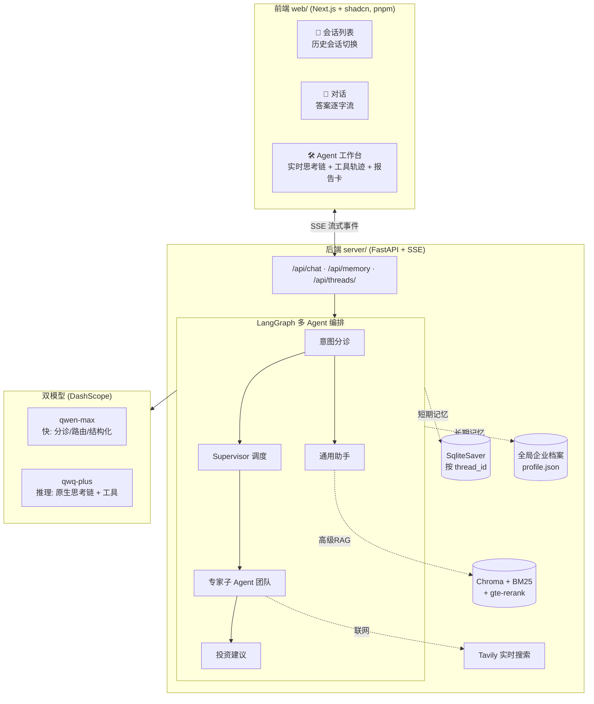
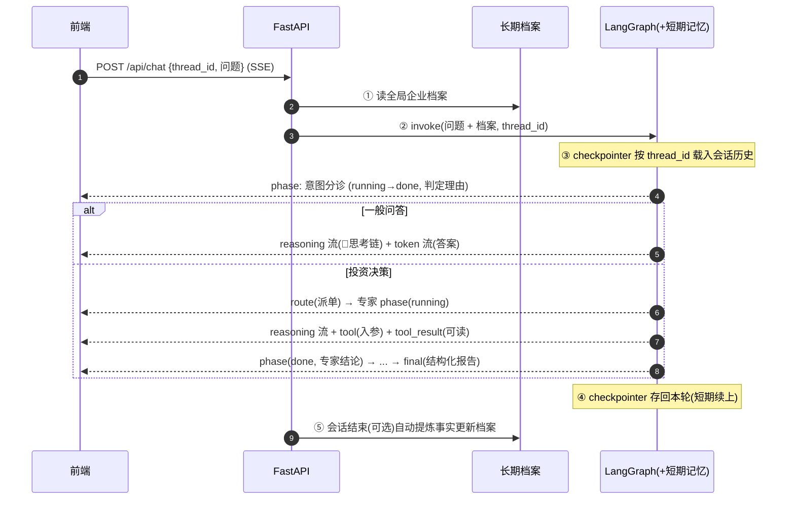
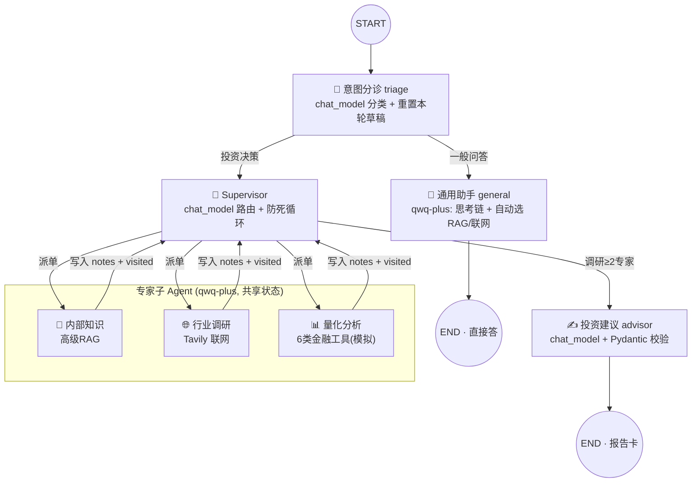
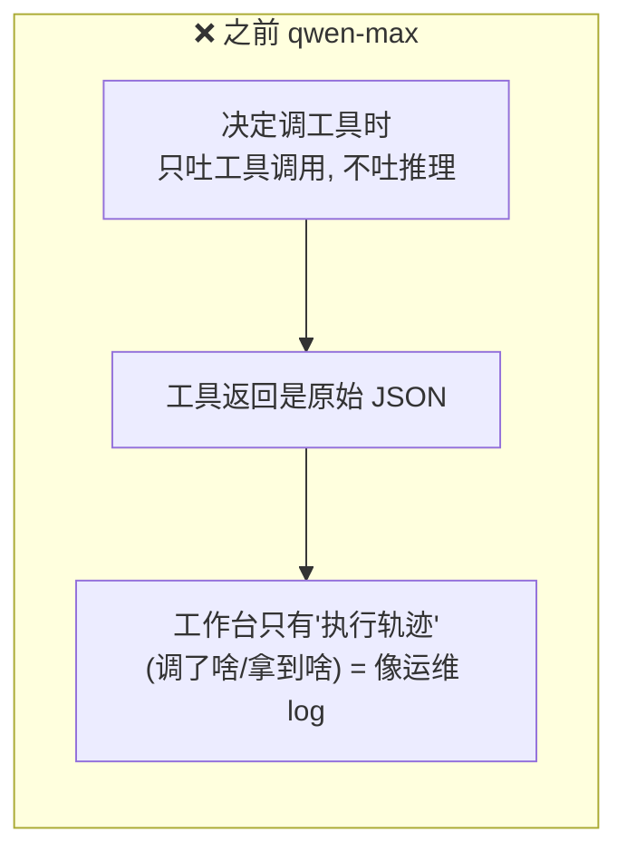
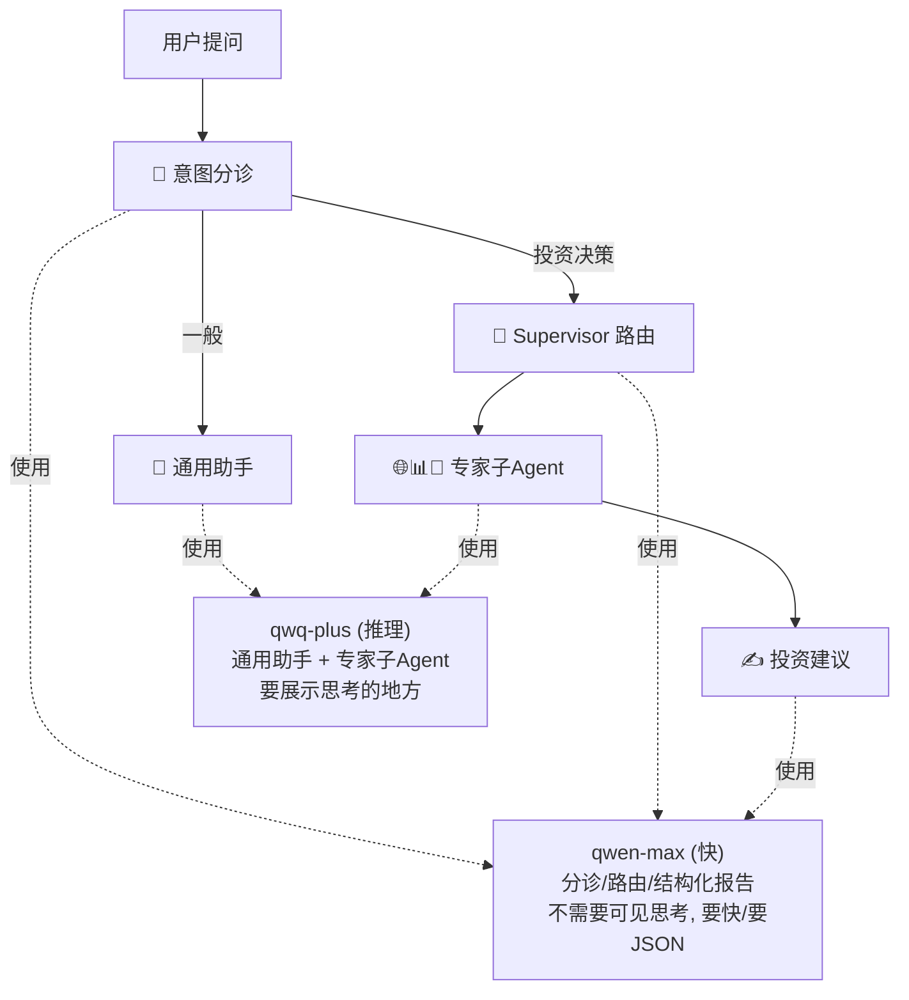
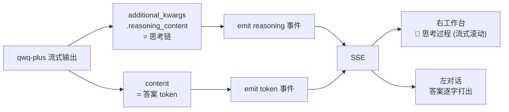
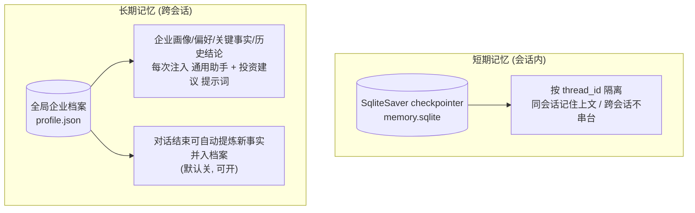
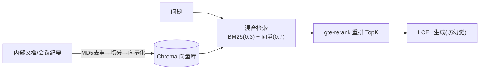

# 商会企业投资顾问 —— 系统说明

> 面向商会会员企业的**多 Agent 智能投资顾问**。一个提问进来，系统**自主研判意图**，
> 再决定"直接答"还是"启动多 Agent 投资决策流程"，并在右侧工作台**实时展示每个 Agent 的原生思考链**（Gemini 式）。

技术栈：LangChain / LangGraph · Tongyi `qwen-max` + `qwq-plus`(推理) · DashScope 向量/重排 · Chroma · BM25 · Tavily · FastAPI(SSE) · Next.js + shadcn

---

## 1. 系统全景



**三层**：前端三栏（会话 / 对话 / 工作台）↔ 后端 FastAPI（SSE 流）↔ LangGraph 多 Agent（接双模型 + 记忆 + RAG + 联网）。

---

## 2. 一次提问的端到端流程



① / ⑤ = 长期记忆（全局档案，跨会话）；③ / ④ = 短期记忆（本会话历史，按 thread 隔离）。

---

## 3. 多 Agent 编排（LangGraph）



**关键设计**：
- **总入口是分诊**，不是所有问题都出报告；简单问题走通用助手直接答。
- **最少调研门槛**（≥2 专家才出建议）+ **最大轮数** 防止"啥都没查就出报告"和死循环。
- **状态分两类**：对话历史 `messages` 跨会话持久；本轮调研草稿 `visited/notes` 每轮 `triage` 时重置（自定义 reducer 支持 `__reset__`）。

---

## 4. 为什么引入"思考模型"（核心改造）

### 4.1 之前不行在哪

之前全程用 `qwen-max`（工具调用模型）。它的毛病不是"展示得不好"，而是**推理根本没被生成**：



| | 之前（执行轨迹）| 想要（Gemini 式思考）|
|---|---|---|
| 本质 | 系统调了什么工具、拿到什么 | 模型在"想"什么——"这是投资决策，得先查关税，因为…" |
| 来源 | 编排日志 | 模型自己吐的 reasoning |
| 读感 | 像 log | 像一个人在分析 |

要"思考"，就得让模型**真的产出推理链（chain-of-thought）**。

### 4.2 探针验证：哪个模型行

实测 DashScope 的推理模型，关键看两点——**能流式吐思考链** 且 **能同时调工具**（Agent 必须用工具）：

| 模型 | 原生思考链 reasoning_content | 同时调工具 | 结论 |
|---|---|---|---|
| `qwen-plus` + `enable_thinking` | ✅ 流式 | ❌ 400 报错(incremental_output 冲突) | 不可用 |
| **`qwq-plus`** | ✅ 流式(一次调研 321 块) | ✅ 可以 | **选它** |

### 4.3 方案：双模型架构

不把所有环节都换成 qwq-plus（它"想"得很深、很慢），而是**按职责分工**：



- **`qwen-max`（快）**：意图分诊、Supervisor 路由、投资建议结构化输出——这些要快、要稳定 JSON，不需要给用户看思考。
- **`qwq-plus`（推理）**：通用助手 + 三个专家子 Agent——这些是真正"干活"的，把它们的思考链展示出来。

### 4.4 思考链怎么流到界面（Gemini 式）



**左答案、右思考**，正是 Gemini 那种体验。代价：qwq-plus 思考深，投资决策完整流程从 ~90s 变为 **3–5 分钟**。

---

## 5. 记忆系统（短期 + 长期）



- **短期**：LangGraph checkpointer，按 `thread_id` 存整段对话；左侧"历史会话"点开即续聊。
- **长期**：单一**全局企业档案**（小而总相关的"核心记忆"，直接注入提示词，不走检索）——这是行业里 Letta/MemGPT 的 core memory 做法，和"文档 RAG"是**两套独立的库**。
- 在档案抽屉里可**手动查看/编辑**。

---

## 6. 高级 RAG（内部知识）



混合检索补关键词召回、重排降误召回；**MD5 去重只用于内部文件**，联网资讯讲新鲜度、只查不落库。

---

## 7. 流式事件协议（SSE）

后端 `execute_events` 吐结构化事件，前端据此渲染：

| 事件 | 含义 | 渲染到 |
|---|---|---|
| `thread` | 会话 id | 记录，刷新会话列表 |
| `phase` | 步骤 running/done（含 mode、判定理由 detail）| 工作台时间线 |
| `route` | Supervisor 派单决定 | 工作台 |
| `reasoning` | **原生思考链增量** | 工作台 💭 思考过程(流式) |
| `token` | **答案增量** | 左对话(打字机) |
| `tool` / `tool_result` | 工具入参 / 可读返回 | 工作台(可展开) |
| `final` | 结构化投资报告 | 工作台报告卡 + 左对话指针 |
| `done` / `error` | 结束 / 出错 | 收尾 / 提示 |

---

## 8. 目录结构

```
meeting-insight-agent/
├── server/main.py            # FastAPI + SSE 后端
├── web/                      # Next.js + shadcn 前端 (pnpm)
│   ├── app/page.tsx          # 三栏布局 + SSE 事件编排
│   └── components/           # chat-panel / worktable / sessions / memory-sheet
├── src/
│   ├── models/factory.py     # 双模型: chat_model(qwen-max) + reasoning_model(qwq-plus)
│   ├── graph/supervisor.py   # 多Agent编排 + 短期记忆 + 事件流
│   ├── agent/                # react_agent(通用助手) / subagents(专家) / advisor / tools
│   ├── memory/               # profile(长期档案) / threads(会话注册表)
│   ├── rag/                  # 向量库 / 混合检索+重排 / 会议KB
│   └── utils/                # config / stream(emit+可读化) / robust(重试降级)
├── config/settings.yml       # 模型/检索/重排/记忆/多Agent 配置
└── main.py                   # CLI: gen-meetings / ingest / ask / advise / ...
```

---

## 9. 诚实说明

- **量化分析的 6 类金融工具是模拟数据**（确定性随机），用于演示工具编排，不是真实测算。
- **联网资讯**走 Tavily 实时检索、不落库（避免过期）。
- **qwq-plus 推理更慢**：换来可见的思考链，投资决策流程会明显变慢；可在 `settings.yml` 切回部分环节用 `qwen-max` 提速。
- 评测用的小问答集与示例文档是合成的，仅演示流程。
